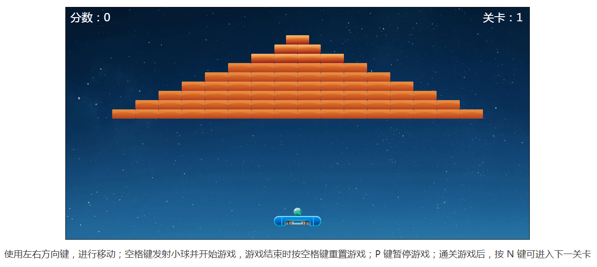

## h5 小游戏—打砖块

本项目是利用原生 js 实现的 h5 小游戏，在实现时使用了大量 es6 语法，对于 es6 语法不太熟悉的小伙伴可以先查阅相关资料了解一下

## 项目截图



## 已完成功能：

- [x] 设计多个关卡
- [x] 显示计分板
- [x] 特殊砖块血量更多
- [x] 小球撞击挡板多角度反弹
- [x] 小球与砖块撞击不同部位，反弹角度不同
- [x] 图片素材更新
- [x] 砖块不同血量下图片自动切换

## 待优化功能：

- [ ] 小球与挡板和砖块之间的碰撞模型不够精确

## 目录结构

```
.
├─ index.html                   // 首页html
│
├─ css                          // css样式资源文件
├─ images                       // 图片资源文件
└─ js
   ├─ common.js                 // 公共方法
   ├─ scene.js                  // 游戏场景相关类
   ├─ game.js                   // 游戏主要运行逻辑
   └─ main.js                   // 游戏运行主函数
```

- common.js => 引入公共方法
- scene.js => 引入游戏场景素材相关类，包括砖块、小球、挡板、生成的砖块对象集合、计分板
- game.js => 引入游戏引擎
- main.js => 游戏运行主函数
